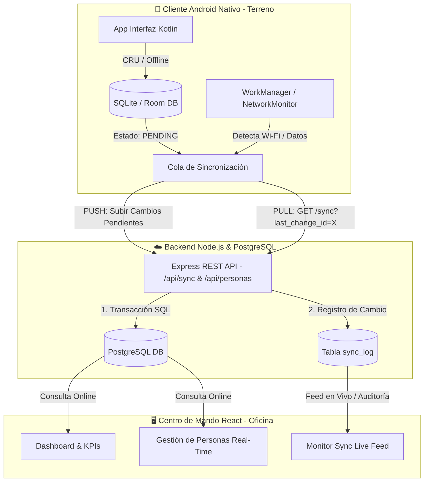

# 🚀 Sincronización Web & App Nativa (Offline-First Architecture)


Una plataforma completa e integral de **Sincronización Offline-First** diseñada para conectar aplicaciones móviles nativas Android (en terreno o zonas sin cobertura) con un backend robusto en **Node.js / PostgreSQL** y un Centro de Mando administrativo en **React + Vite**.

---

## 🏗️ Arquitectura y Flujo de Sincronización

El sistema utiliza un protocolo de **Sincronización Asíncrona (Push & Pull)** respaldado por una tabla de auditoría (`sync_log`) y borrado lógico (*Soft Delete*):



---

## ✨ Características Principales

### 📱 1. Cliente Android Nativo (Offline-First)
- **Persistencia Local:** Almacenamiento seguro en **SQLite / Room** sin depender de conexión a internet.
- **Sincronización Automática:** Uso de **WorkManager** para detectar la restauración de la red (Wi-Fi/Datos) y disparar tareas en segundo plano.
- **Resolución de Conflictos:** Control de versiones basado en `uuid` y campo `version`.

### ⚡ 2. Backend Node.js + Express + PostgreSQL
- **Borrado Lógico (Soft Delete):** Ningún registro se destruye físicamente. Al eliminar, se asigna fecha a `deleted_at`, preservando la integridad referencial para los dispositivos fuera de línea.
- **Historial Incremental (`sync_log`):** Cada operación (`CREATE`, `UPDATE`, `DELETE`) genera un evento inmutable con un `change_id` secuencial para sincronizaciones ultrarrápidas (*Pull*).
- **Validaciones & Seguridad:** Protección de endpoints con `express-validator` y manejo de CORS para clientes móviles/locales.

### 🖥️ 3. Centro de Mando Web (React + Vite + Lucide)
- **Diseño Glassmorphism Premium:** Interfaz moderna en Modo Oscuro con paneles translúcidos y micro-animaciones.
- **Monitor de Sincronización en Vivo:** Línea de tiempo interactiva (*Timeline*) que permite inspeccionar el payload JSON exacto de los eventos que entran desde los móviles.
- **Gestión de Papelera:** Módulo dedicado para auditar y administrar los registros eliminados por borrado lógico.

---

## 📂 Estructura del Proyecto

```text
├── android/          # Código fuente e interfaz nativa Android (Kotlin + Room)
├── backend/          # API REST (Node.js, Express, PostgreSQL, pg)
│   ├── src/
│   │   ├── controllers/  # Controladores (Personas y Sincronización)
│   │   ├── database/     # Scripts SQL y esquemas de tablas
│   │   ├── routes/       # Definición de endpoints (/api/personas, /api/sync)
│   │   └── services/     # Lógica de negocio y registro de Sync Log
│   └── docs/             # Documentación técnica de la API y flujos
└── frontend/         # Web App Administrativa (React 19 + Vite + Lucide Icons)
    └── src/
        ├── components/   # Vistas: Dashboard, Personas, Monitor Sync, Papelera
        └── services/     # Cliente de conexión API REST
```

---

## 🚀 Guía de Inicio Rápido (Desarrollo Local)

### 1️⃣ Requisitos Previos
- [Node.js](https://nodejs.org/) (v18 o superior)
- [PostgreSQL](https://www.postgresql.org/) (v14 o superior)
- [Android Studio](https://developer.android.com/studio) (Para el cliente móvil)

### 2️⃣ Configurar y Ejecutar el Backend
```bash
cd backend
npm install

# Configurar variables de entorno (Crear archivo .env)
cp .env.example .env  # Configura tus credenciales de PostgreSQL en .env

# Iniciar servidor en modo desarrollo (Puerto 3000)
npm run dev
```

### 3️⃣ Configurar y Ejecutar la Web App (Frontend)
```bash
cd frontend
npm install

# Iniciar servidor local de Vite (Puerto 5173)
npm run dev
```
Abre tu navegador en: `http://localhost:5173/`

### 4️⃣ Conectar el Teléfono o Emulador Android
1. Asegúrate de que tu PC y tu teléfono móvil estén en la **misma red Wi-Fi**.
2. Configura la IP de tu servidor (ej. `http://192.168.X.X:3000`) en el archivo de configuración del cliente móvil (`network_security_config.xml` y `PersonaApi.kt`).

---

## 📄 Documentación API
Puedes consultar la documentación completa de endpoints, parámetros y estructuras de respuesta en:
[📖 Documentación de la API REST](backend/docs/api.md)

---
*Desarrollado con arquitectura Offline-First para máxima resiliencia en terreno y control administrativo en tiempo real.*
