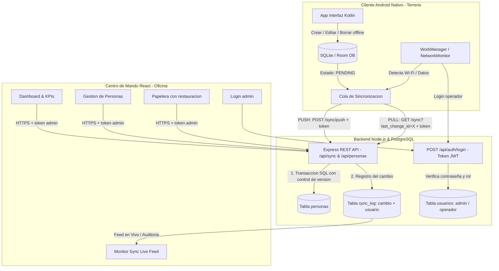

# Sincronización Web & App Nativa (Offline-First Architecture)


Una plataforma completa e integral de **Sincronización Offline-First** diseñada para conectar aplicaciones móviles nativas Android (en terreno o zonas sin cobertura) con un backend robusto en **Node.js / PostgreSQL** y un Centro de Mando administrativo en **React + Vite**.

---

## Arquitectura y Flujo de Sincronización

El sistema utiliza un protocolo de **Sincronización Asíncrona (Push & Pull)** respaldado por una tabla de auditoría (`sync_log`) y borrado lógico (*Soft Delete*):


```mermaid
graph TD
    subgraph Movil [Cliente Android Nativo - Terreno]
        UI[App Interfaz Kotlin] -->|Crear / Editar / Borrar offline| ROOM[(SQLite / Room DB)]
        ROOM -->|Estado: PENDING| COLA[Cola de Sincronizacion]
        WORKER[WorkManager / NetworkMonitor]
    end

    subgraph Servidor [Backend Node.js & PostgreSQL]
        AUTH[POST /api/auth/login - Token JWT]
        API[Express REST API - /api/sync & /api/personas]
        PG[(Tabla personas)]
        LOG[(Tabla sync_log: cambio + usuario)]
        USR[(Tabla usuarios: admin / operador)]
        AUTH -->|Verifica contraseña y rol| USR
        API -->|1. Transaccion SQL con control de version| PG
        API -->|2. Registro del cambio| LOG
    end

    subgraph Web [Centro de Mando React - Oficina]
        LOGIN[Login admin]
        DASH[Dashboard & KPIs]
        CRUD[Gestion de Personas]
        TRASH[Papelera con restauracion]
        FEED[Monitor Sync Live Feed]
    end

    WORKER -->|Detecta Wi-Fi / Datos| COLA
    WORKER -->|Login operador| AUTH
    COLA -->|PUSH: POST /sync/push + token| API
    COLA -->|PULL: GET /sync?last_change_id=X + token| API
    LOGIN --> AUTH
    DASH & CRUD & TRASH -->|HTTPS + token admin| API
    LOG -->|Feed en Vivo / Auditoria| FEED
```

---

## Características Principales

### 1. Cliente Android Nativo (Offline-First)
- **Persistencia Local:** Almacenamiento seguro en **SQLite / Room** sin depender de conexión a internet.
- **Sincronización Automática:** Uso de **WorkManager** para detectar la restauración de la red (Wi-Fi/Datos) y disparar tareas en segundo plano.
- **Resolución de Conflictos:** Control de versiones basado en `uuid` y campo `version`.

### 2. Backend Node.js + Express + PostgreSQL
- **Borrado Lógico (Soft Delete):** Ningún registro se destruye físicamente. Al eliminar, se asigna fecha a `deleted_at`, preservando la integridad referencial para los dispositivos fuera de línea.
- **Historial Incremental (`sync_log`):** Cada operación (`CREATE`, `UPDATE`, `DELETE`) genera un evento inmutable con un `change_id` secuencial para sincronizaciones ultrarrápidas (*Pull*).
- **Validaciones & Seguridad:** Protección de endpoints con `express-validator` y manejo de CORS para clientes móviles/locales.

### 3. Centro de Mando Web (React + Vite + Lucide)
- **Diseño Glassmorphism Premium:** Interfaz moderna en Modo Oscuro con paneles translúcidos y micro-animaciones.
- **Monitor de Sincronización en Vivo:** Línea de tiempo interactiva (*Timeline*) de los eventos de `sync_log`: operación, fecha, usuario que hizo el cambio y estado actual del registro afectado.
- **Gestión de Papelera:** Módulo dedicado para auditar y administrar los registros eliminados por borrado lógico.

---

## Estructura del Proyecto

El repositorio incluye las tres piezas: backend, panel web y app Android. El contrato entre la app y la API está en [docs/api.md](docs/api.md) y el flujo completo en [docs/documento.md](docs/documento.md).

```text
├── .github/workflows/ # CI en cada PR: tests del backend, lint + build del frontend y tests + APK de Android
├── android/          # App móvil (Kotlin, Jetpack Compose, Room, WorkManager, Retrofit)
│   └── app/src/main/java/com/sincronizacion/app/
│       ├── data/         # Room (local), Retrofit (remote), sesión cifrada, repositorios y Sincronizador
│       ├── domain/       # Lógica pura de la cola y de los resultados del push (con tests)
│       ├── sync/         # SyncWorker y programación de WorkManager
│       └── ui/           # Pantallas: login, lista de personas y formulario
├── backend/          # API REST (Node.js, Express, PostgreSQL, pg)
│   ├── scripts/          # crear-usuario.js (alta, cambio de contraseña y baja de usuarios)
│   ├── test/             # Tests de integración (node:test + PostgreSQL embebido)
│   └── src/
│       ├── config/       # Conexión a PostgreSQL y configuración de seguridad
│       ├── controllers/  # Controladores (Auth, Personas y Sincronización)
│       ├── database/     # Scripts SQL: esquema, datos de ejemplo y migraciones
│       ├── middleware/   # Autenticación, roles, límites de peticiones y errores
│       ├── routes/       # Endpoints (/api/auth, /api/personas, /api/sync)
│       ├── services/     # Lógica de negocio, push por lotes y registro de Sync Log
│       └── validators/   # Reglas de validación (express-validator)
├── despliegue/       # Producción en el VPS: Docker Compose (PostgreSQL + API + panel), Nginx y scripts
├── docs/             # Documentación técnica: API (api.md) y arquitectura (documento.md)
└── frontend/         # Web App Administrativa (React 19 + Vite + Lucide Icons)
    └── src/
        ├── components/   # Vistas: Login, Dashboard, Personas, Monitor Sync, Papelera
        └── services/     # Cliente de la API REST con sesión
```

---

## Guía de Inicio Rápido (Desarrollo Local)

### 1. Requisitos Previos
- [Node.js](https://nodejs.org/) (v18 o superior)
- [PostgreSQL](https://www.postgresql.org/) (v14 o superior)
- [Android Studio](https://developer.android.com/studio) (Para el cliente móvil)

### 2. Configurar y Ejecutar el Backend
```bash
cd backend
npm install

# Configurar variables de entorno (Crear archivo .env)
cp .env.example .env  # Configura PostgreSQL y JWT_SECRET en .env

# Generar un JWT_SECRET (cópialo en .env; sin él el servidor no arranca)
node -e "console.log(require('crypto').randomBytes(48).toString('hex'))"

# Iniciar servidor en modo desarrollo (Puerto 3000)
npm run dev
```

Crea la base de datos ejecutando **en orden** los scripts de `backend/src/database/`: `01_create_database.sql`, `02_create_tables.sql`, `03_seed.sql`, `04_add_version_column.sql`, `05_create_usuarios.sql`, `06_correo_unico_activos.sql` y `07_registrar_personas_sin_historial.sql`. Los scripts 04 a 07 también sirven para actualizar una base ya existente; el 07 registra en el historial de sincronización las personas que no aparecían en él (por ejemplo, los datos de ejemplo de bases antiguas), para que los dispositivos las descarguen. En producción no hace falta ejecutarlos: la API los aplica al arrancar (ver "Despliegue en Internet").

#### Crear usuarios
No existe registro público: los usuarios se crean desde la consola del servidor. La contraseña se pide por teclado (mínimo 10 caracteres).
```bash
# Administrador del panel web
npm run crear-usuario -- --correo admin@tuempresa.com --nombre "Ana Admin" --rol admin

# Un operador por cada dispositivo o persona en terreno
npm run crear-usuario -- --correo tablet1@tuempresa.com --nombre "Tablet 1" --rol operador

# Cambiar la contraseña / reactivar
npm run crear-usuario -- --correo tablet1@tuempresa.com --actualizar

# Revocar el acceso (ej. dispositivo perdido): sus sesiones dejan de funcionar al momento
npm run crear-usuario -- --correo tablet1@tuempresa.com --desactivar
```

| Rol | Uso | Acceso |
|-----|-----|--------|
| `admin` | Panel web | Todo: `/api/personas`, `/api/sync`, `/api/sync/push` |
| `operador` | App Android | Solo sincronización: `/api/sync` y `/api/sync/push` |

### 3. Configurar y Ejecutar la Web App (Frontend)
```bash
cd frontend
npm install

# Opcional: cambiar la URL del backend (por defecto http://localhost:3000)
cp .env.example .env

# Iniciar servidor local de Vite (Puerto 5173)
npm run dev
```
Abre tu navegador en: `http://localhost:5173/`

Inicia sesión con un usuario `admin`.

### 4. App Android en tu teléfono
Requiere [Android Studio](https://developer.android.com/studio) (trae su propio Java y descarga el SDK la primera vez).

1. **Misma red:** el PC y el teléfono deben estar en la **misma red Wi-Fi**. El backend debe estar en marcha con `HOST=0.0.0.0`, y el Firewall de Windows debe permitir el puerto `3000` en redes privadas.
2. **URL de la API:** crea `android/local.properties` con la IP de tu PC (puedes verla con `ipconfig`):
   ```properties
   api.url=http://192.168.X.X:3000/api/
   ```
   Si no lo creas, se usa la de `android/gradle.properties`.
3. **Teléfono:** activa las *Opciones de desarrollador* (pulsa 7 veces *Número de compilación* en *Ajustes → Acerca del teléfono*) y dentro activa *Depuración por USB* (o *Depuración inalámbrica*).
4. **Usuario:** crea un usuario `operador` con `npm run crear-usuario`. El panel web es solo para administradores.
5. Abre la carpeta `android/` en Android Studio, elige tu teléfono y pulsa **Run**.

La versión de desarrollo permite HTTP hacia el backend local; la versión `release` exige HTTPS.

### 5. APK de producción (release)
La APK `release` se firma con una clave propia. **Guarda esa clave y sus contraseñas fuera del repositorio y con copia de seguridad:** si se pierde, no se podrán publicar actualizaciones de la app con la misma identidad.

1. **Crear la clave (una sola vez).** Desde la carpeta `android/`, con el `keytool` del Java de Android Studio; te pedirá las contraseñas:
   ```bash
   mkdir firma
   "C:/Program Files/Android/Android Studio/jbr/bin/keytool" -genkeypair -v -keystore firma/syncpulse-release.jks -alias syncpulse -keyalg RSA -keysize 4096 -validity 10000
   ```
2. **Configurar la firma.** Copia `android/keystore.properties.example` como `android/keystore.properties` y escribe las contraseñas. Tanto ese archivo como la carpeta `firma/` están en `.gitignore`.
3. **URL de producción.** Por defecto la APK `release` usa el servidor de producción (`api.url.release` en `android/gradle.properties`: `https://proyectosena.online/sincronizacion/api/`). Para compilarla contra otro servidor, define `api.url.release` en `android/local.properties`.
4. **Compilar:** `./gradlew assembleRelease` genera `android/app/build/outputs/apk/release/app-release.apk` (o `./gradlew bundleRelease` para un `.aab` de Google Play).

Si falta la firma o la URL no empieza por `https://`, la compilación se detiene y explica qué falta. Antes de cada versión nueva, sube `versionCode` (y `versionName`) en `android/app/build.gradle.kts`.

---

## Pruebas

Los tests del backend levantan su propio **PostgreSQL embebido** (no hace falta tenerlo instalado) y prueban la API real: autenticación y roles, push con conflictos y concurrencia, papelera, validaciones, el script de usuarios y las migraciones sobre el esquema original.

```bash
cd backend
npm test
```

En cada pull request, GitHub Actions ejecuta estos tests, el linter (sin avisos permitidos) y la compilación del frontend, y los tests y la APK de desarrollo de la app Android. Si algo falla, el PR no se puede fusionar en `main`.

---

## Despliegue en Internet

La API maneja datos personales, así que en Internet **solo debe servirse por HTTPS**. Node no gestiona los certificados: un proxy delante (Nginx, Caddy o el del hosting) termina HTTPS y reenvía a la API.

### En el VPS (proyectosena.online)

Producción vive dentro del sitio del portafolio, junto a los demás proyectos:

| Qué | Dirección |
|---|---|
| Panel web | `https://proyectosena.online/sincronizacion/` |
| API (la usa la app) | `https://proyectosena.online/sincronizacion/api/` |
| APK firmada | `https://proyectosena.online/sincronizacion/descargas/syncpulse.apk` |

Todo corre en Docker Compose (`despliegue/docker-compose.yml`), sin tocar el Node ni el PostgreSQL del servidor, y lo despliega **Dokploy** en cada push a `main`:

```text
Internet ─HTTPS─> Nginx del servidor ─/sincronizacion/─> 127.0.0.1:3020 contenedor web (Nginx: panel compilado)
                                                                         └─ /api/ ─> contenedor api (Node) ─> contenedor db (PostgreSQL 16)
```

Solo el contenedor `web` publica un puerto, y solo en `127.0.0.1`; la API y la base no son accesibles desde fuera de Docker. Al arrancar, la API (`MIGRAR_AL_INICIAR=true`) crea el esquema con los datos de ejemplo si la base está vacía y aplica las migraciones de `backend/src/database` a partir de la 04 (`backend/src/database/migrar.js`); si una falla, se deshace y la API no arranca.

**Dokploy** (una sola vez):

1. *Create Service → Compose*, origen GitHub: repositorio `Aryannext/Sincronizaci-n-Web---app-Nativa`, rama `main`, *Compose Path* `./despliegue/docker-compose.yml`.
2. En *Environment*, las variables de `despliegue/.env.example`: como mínimo `DB_PASSWORD` y `JWT_SECRET` (`openssl rand -hex 24` y `openssl rand -hex 48`). La contraseña de la base solo se fija al crearla: si el volumen `sincronizacion_datos` ya existe, usa la que tenía.
3. Activa *Autodeploy* y pulsa *Deploy*. No hace falta configurar dominio en Dokploy: lo publica el Nginx del servidor.

**Nginx del servidor** (una sola vez). El fragmento `despliegue/nginx/sincronizacion.conf` se lee de un clon del repositorio en el servidor:

```bash
git clone https://github.com/Aryannext/Sincronizaci-n-Web---app-Nativa.git ~/proyectos/proyectosena.online/sincronizacion
```

y se incluye en el bloque `server` 443 de `proyectosena.online`:

```nginx
include /home/cristian/proyectos/proyectosena.online/sincronizacion/despliegue/nginx/sincronizacion.conf;
```

Recarga con `sudo nginx -t && sudo systemctl reload nginx`. Si el puerto `3020` estuviera ocupado (`ss -ltn`), cambia `SINCRONIZACION_PUERTO` en Dokploy y el `proxy_pass` del fragmento. Si algún día cambia el fragmento, actualiza el clon con `git pull` y recarga Nginx.

**Usuarios** (la contraseña se pide por teclado):

```bash
docker exec -it "$(docker ps -qf ancestor=sincronizacion-api:actual)" npm run crear-usuario -- --correo admin@tuempresa.com --nombre "Ana Admin" --rol admin
```

**APK firmada** (ver "APK de producción"): se sube desde tu PC a `~/descargas-sincronizacion/` (créala una vez con `mkdir`):

```bash
scp android/app/build/outputs/apk/release/app-release.apk cristian@proyectosena.online:descargas-sincronizacion/syncpulse.apk
```

**Actualizar:** fusiona en `main` y Dokploy reconstruye y reinicia solo; las migraciones nuevas se aplican al arrancar la API. Para levantarlo a mano sin Dokploy: copia `despliegue/.env.example` como `despliegue/.env`, complétalo y ejecuta `docker compose up -d --build --wait` desde `despliegue/`.

### En otro servidor

1. En el `.env` del servidor: `HOST=127.0.0.1` (solo el proxy llega a la API), `TRUST_PROXY=1` (el límite de peticiones ve la IP real), `CORS_ORIGINS` con el dominio del panel y un `JWT_SECRET` propio de producción.
2. Proxy HTTPS delante, por ejemplo con [Caddy](https://caddyserver.com/), que obtiene y renueva el certificado solo:
   ```
   api.tuempresa.com {
       reverse_proxy 127.0.0.1:3000
   }
   ```
3. Compila el panel con `VITE_API_URL=https://api.tuempresa.com npm run build` (y `VITE_BASE=/ruta/` si no va en la raíz del dominio) y publica `frontend/dist`.
4. Compila y firma la app en modo `release` con `api.url.release=https://api.tuempresa.com/api/` en `android/local.properties` (ver "APK de producción"); esa versión no permite tráfico en claro.

---

## Documentación API
Puedes consultar la documentación completa de endpoints, parámetros y estructuras de respuesta en:
[Documentación de la API REST](docs/api.md)

---
*Desarrollado con arquitectura Offline-First para máxima resiliencia en terreno y control administrativo en tiempo real.*
