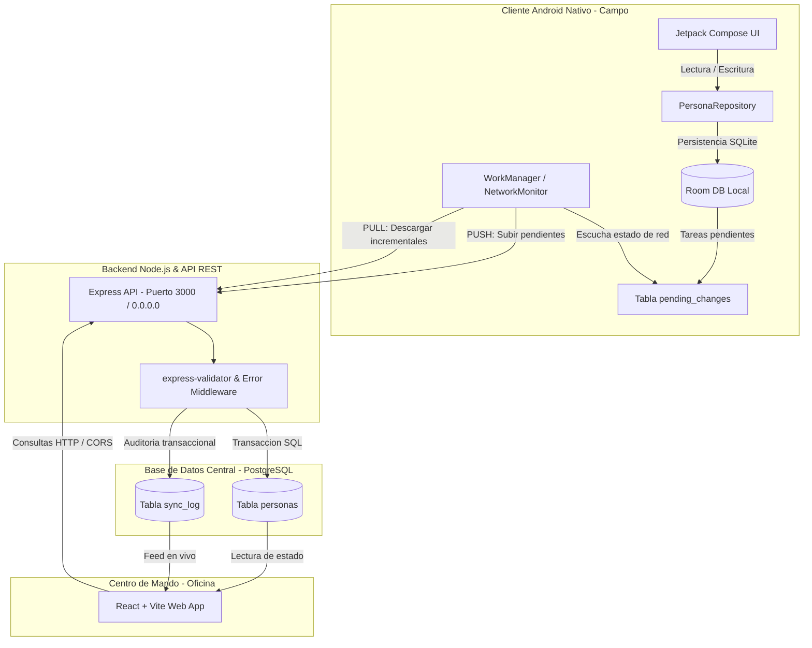
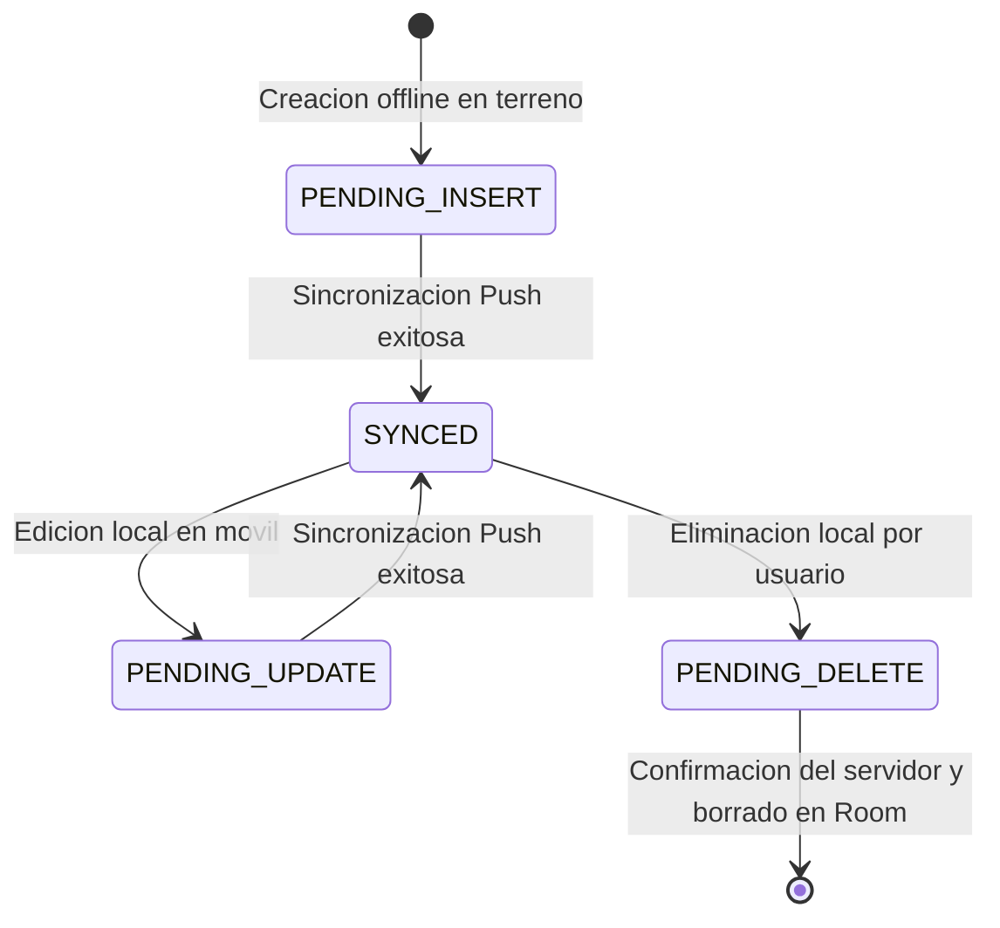
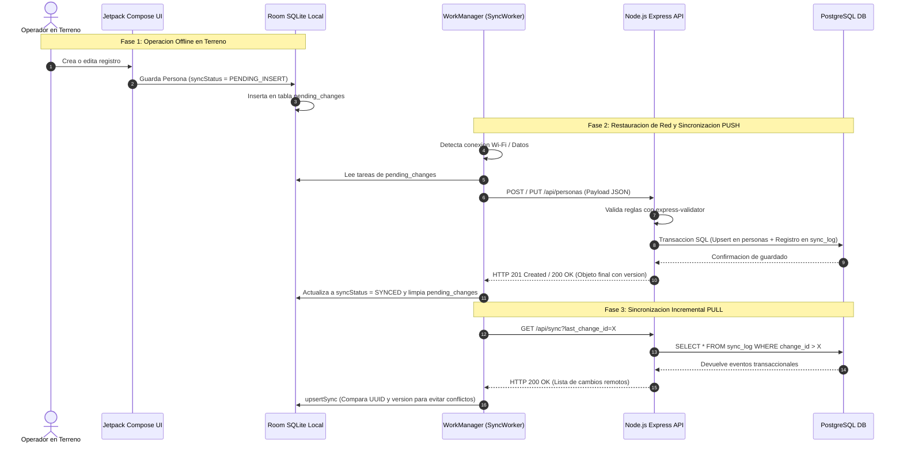

# Documentación Técnica: Sistema de Sincronización Offline-First

Esta aplicación utiliza una estrategia **Offline-First**. Esto significa que la aplicación siempre interactúa primero con una base de datos local y sincroniza los cambios con el servidor de forma asíncrona cuando hay conexión a internet o red local.

---

## 1. Visión General de la Arquitectura
El sistema utiliza una arquitectura de **Tres Capas** diseñada para funcionar sin conexión a internet de forma indefinida y sincronizarse automáticamente al detectar red:

- **Cliente (Android):** Utiliza **Jetpack Compose** para la interfaz de usuario (UI), **Room** como base de datos relacional local (SQLite) y **WorkManager** para la programación y ejecución de tareas de sincronización en segundo plano.
- **Servidor (API REST):** Backend construido en **Node.js + Express** que actúa como validador de reglas de negocio, gestor de historiales de cambio (`sync_log`) y puente hacia la base de datos central.
- **Base de Datos (PostgreSQL):** El *"Single Source of Truth"* (Fuente única de verdad) donde residen los datos finales, versiones y el estado consolidado de todos los usuarios.
- **Centro de Mando Web (React + Vite):** Cliente administrativo en oficina que permite monitorear las sincronizaciones en tiempo real, auditar eventos y gestionar la base de datos de forma online.

### Diagrama de Arquitectura del Sistema

---

## 2. Configuración de Conexión Local (Detalle Crítico)
Para que la comunicación funcione entre los dispositivos Android (móvil físico o emulador) y el servidor local en tu PC (ejemplo de red: `192.168.40.5`), se implementaron tres niveles de configuración y acceso:

1. **Nivel de API (Android):** En el archivo `PersonaApi.kt`, la constante `BASE_URL` apunta directamente a la IP privada de tu computadora (ej: `http://192.168.40.5:3000/api/`). Esto permite que el móvil salga de su propia red interna y alcance el servidor en la red Wi-Fi local.
2. **Nivel de Seguridad (Android):** En `app/src/main/res/xml/network_security_config.xml`, se autorizó explícitamente el tráfico *cleartext* (HTTP sin cifrado SSL/TLS) para la dirección IP `192.168.40.5`. Sin esta directiva, el sistema operativo Android bloquea la petición HTTP por políticas de seguridad modernas.
3. **Nivel de Servidor (Node.js):** El servidor Express está configurado en `server.js` con la instrucción `app.listen(PORT, '0.0.0.0')`. Escuchar en la interfaz `0.0.0.0` permite que Node.js reciba peticiones externas de cualquier dispositivo dentro de la misma red local (como tu teléfono físico), y no únicamente desde el propio PC (`localhost` o `127.0.0.1`). Además, se habilitó el middleware `cors()` para aceptar tráfico cruzado.

---

## 3. El Modelo de Datos y Estados de Sync
Para rastrear el ciclo de vida de cada registro sin conexión, la entidad `Persona` en la base de datos local Room cuenta con una propiedad vital llamada `syncStatus`:

- **`SYNCED`:** El dato local está perfectamente alineado e idéntico a la versión almacenada en el servidor PostgreSQL.
- **`PENDING_INSERT`:** Persona creada localmente en el móvil sin conexión a internet. Está lista para ser empujada en el próximo ciclo Push.
- **`PENDING_UPDATE`:** Persona editada localmente en el móvil; el servidor PostgreSQL aún posee una versión anterior del registro.
- **`PENDING_DELETE`:** Persona marcada por el usuario para eliminar; el registro se mantiene en Room con una fecha en `deletedAt` hasta que el servidor reciba la notificación y confirme el borrado lógico.

### Diagrama de Ciclo de Vida del Estado de Sincronización (`syncStatus`)

---

## 4. Lógica de Sincronización (Paso a Paso)
La sincronización se divide en dos flujos complementarios: **Push** (Enviar cambios locales al servidor) y **Pull** (Descargar novedades remotas al móvil).

### A. El Repositorio (`PersonaRepository.kt`)
Actúa como el director de orquesta entre Room y Retrofit. Cuando el usuario pulsa el botón *"Guardar"* en la interfaz gráfica:
1. **Escribe en Room:** Guarda de forma inmediata el objeto en la base de datos SQLite local asignándole el estado `PENDING_INSERT` (o `PENDING_UPDATE`).
2. **Registra el Cambio:** Inserta una fila en la tabla de cola local `pending_changes` especificando el `uuid` del registro y el tipo de operación. Esta tabla funciona como una memoria transaccional de lo que debe enviarse al servidor.
3. **Intento Inmediato:** Llama al método `tryToSyncPush()`.
   - *Si hay internet:* Envía los datos instantáneamente a la API REST Node.js y actualiza el estado a `SYNCED`.
   - *Si NO hay internet:* Captura la excepción de red de forma silenciosa; la tarea queda guardada en `pending_changes` sin interrumpir la experiencia del usuario.

### B. El Worker de Fondo (`SyncWorker.kt`)
Utiliza la librería oficial **Android WorkManager** para garantizar la ejecución en segundo plano.
- **Configuración de Restricciones:** Se encola con la restricción de red obligatoria: `.setRequiredNetworkType(NetworkType.CONNECTED)`.
- **Activación Automática:** El sistema operativo Android monitorea los adaptadores de red y despierta este Worker exactamente en el instante en que el móvil recupera la conectividad Wi-Fi o Datos Celulares.
- **Proceso de Ejecución:**
  1. Ejecuta primero `tryToSyncPush()` para vaciar la tabla `pending_changes` y subir todas las creaciones, ediciones o borrados pendientes.
  2. Ejecuta inmediatamente después `syncPull()`, consultando el endpoint `GET /api/sync?last_change_id=X` para descargar las novedades que otros usuarios o administradores web hayan realizado.

### C. Estrategia de Conflicto y Resolución (`Upsert`)
Para evitar duplicados, colisiones de IDs y pérdida de información en entornos concurrentes:
- **Identificadores Universales (`UUID`):** Cada registro nace con un UUID único generado en el cliente o servidor, evitando colisiones aunque dos móviles creen registros offline simultáneamente.
- **Lógica de Conflicto (`upsertSync`):** Al descargar datos del servidor, el DAO de Room compara el campo `version`. Si el UUID ya existe localmente, pero el dato entrante del servidor tiene un número de `version` mayor, el móvil sobrescribe el registro local con la versión oficial del servidor.

### Diagrama de Secuencia: Flujo Transaccional Push & Pull

---

## 5. Flujo de Datos Completo (De Terreno a Base de Datos)
El ciclo de vida transaccional sigue estos 6 pasos secuenciales:

1. **Creación Offline:** El usuario en terreno crea una Persona en la app Android -> Se guarda en **Room** con `syncStatus = PENDING_INSERT` -> Se inserta la tarea en la tabla `pending_changes`.
2. **Detección de Red:** El móvil recupera cobertura o se conecta al Wi-Fi -> El sistema operativo despierta al **SyncWorker**.
3. **Fase Push:** El SyncWorker lee la cola `pending_changes` -> Realiza una petición HTTP `POST /api/personas` enviando el payload JSON a Node.js.
4. **Procesamiento en Backend:** Node.js recibe el JSON -> Valida los campos con `express-validator` -> Inserta el registro en **PostgreSQL** y escribe una fila de auditoría en `sync_log`.
5. **Respuesta Confirmada:** Node.js responde con código HTTP `201 Created` o `200 OK` devolviendo el objeto final consolidado (incluyendo la `version` e ID interno de Postgres).
6. **Cierre de Ciclo en Móvil:** El móvil recibe la respuesta del servidor -> Actualiza el registro en Room a `syncStatus = SYNCED` -> Elimina la tarea completada de la tabla `pending_changes`.

---

## 6. Manejo de Errores y Resiliencia
- **Servidor Caído o Inaccesible:** Si el dispositivo móvil tiene internet activo pero tu PC o servidor Node.js está apagado, la llamada de Retrofit lanza una excepción. El `SyncWorker` la captura y retorna `Result.retry()`. WorkManager reprogramará automáticamente el intento aplicando una política de *Backoff Exponencial* (esperando 1 minuto, luego 2, 4, 8, etc.), evitando saturar la red o gastar batería.
- **Sobrevivencia al Cierre de la App:** Si el usuario cierra la aplicación deslizándola de las tareas recientes o apaga la pantalla justo mientras se está sincronizando, no hay pérdida de datos. WorkManager opera como un servicio del sistema del kernel de Android y completará la sincronización en segundo plano de manera totalmente independiente a la interfaz gráfica.

---

## 7. Centro de Mando Web (Complemento Administrativo)
Mientras el cliente Android está optimizado para trabajadores en terreno (*Offline-First*), la aplicación web en **React + Vite** ofrece el control total en oficina:
- **Monitor de Sincronización en Vivo:** Escucha y visualiza la tabla `sync_log`, mostrando en una línea de tiempo (*Timeline*) cada evento `CREATE`, `UPDATE` o `DELETE` que los móviles empujan al servidor.
- **Inspector de Payloads JSON:** Permite a los supervisores o desarrolladores hacer clic en cualquier transacción del historial para auditar la estructura JSON exacta intercambiada.
- **Papelera de Reciclaje (Borrado Lógico):** Visibiliza todos los registros donde `deleted_at IS NOT NULL`, garantizando auditoría total sobre los borrados realizados en campo.

---

## 8. Guía de Verificación y Mantenimiento
1. **Verificar IP Local:** Si cambias de red Wi-Fi o de enrutador, la IP privada de tu PC podría cambiar. Asegúrate de actualizar la constante `BASE_URL` en `PersonaApi.kt` y la autorización en `network_security_config.xml`.
2. **Inspeccionar Logs de Sincronización:** En Android Studio, abre la pestaña **Logcat** y filtra por las etiquetas `PersonaRepository` o `SyncWorker` para observar el flujo de peticiones HTTP en tiempo real.
3. **Verificar Estado del Backend:** Asegúrate de que tu servidor Node.js esté ejecutándose (`npm run dev` en la carpeta `backend/`) y que el Firewall de Windows permita el tráfico entrante al puerto `3000`.

*Esta arquitectura sólida garantiza que el usuario en terreno jamás pierda información valiosa, permitiéndole operar en zonas rurales o sin señal con la certeza de que todo su trabajo se sincronizará de forma invisible y segura al recuperar la conectividad.*
