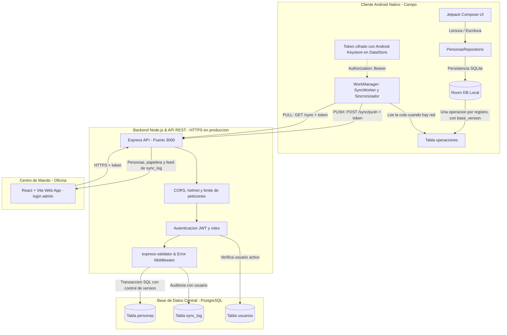
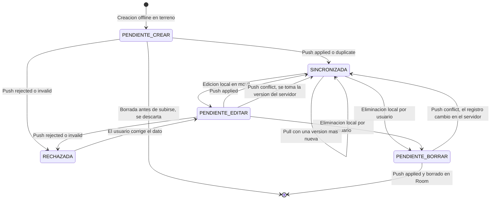
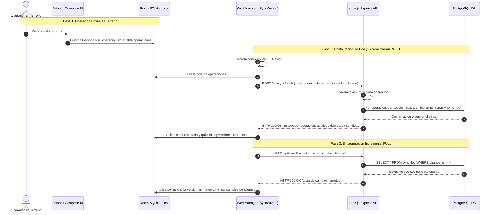

# Documentación Técnica: Sistema de Sincronización Offline-First

Esta aplicación utiliza una estrategia **Offline-First**. Esto significa que la aplicación siempre interactúa primero con una base de datos local y sincroniza los cambios con el servidor de forma asíncrona cuando hay conexión a internet o red local.

---

> **Alcance del repositorio:** backend (`backend/`, Node.js + PostgreSQL), panel web (`frontend/`, React) y app móvil (`android/`, Kotlin + Room). El contrato exacto entre la app y la API está en [api.md](api.md).

## 1. Visión General de la Arquitectura
El sistema utiliza una arquitectura de **Tres Capas** diseñada para funcionar sin conexión a internet de forma indefinida y sincronizarse automáticamente al detectar red:

- **Cliente (Android):** Utiliza **Jetpack Compose** para la interfaz de usuario (UI), **Room** como base de datos relacional local (SQLite) y **WorkManager** para la programación y ejecución de tareas de sincronización en segundo plano.
- **Servidor (API REST):** Backend construido en **Node.js + Express** que actúa como validador de reglas de negocio, gestor de historiales de cambio (`sync_log`) y puente hacia la base de datos central.
- **Base de Datos (PostgreSQL):** El *"Single Source of Truth"* (Fuente única de verdad) donde residen los datos finales, versiones y el estado consolidado de todos los usuarios.
- **Centro de Mando Web (React + Vite):** Cliente administrativo en oficina que permite monitorear las sincronizaciones en tiempo real, auditar eventos y gestionar la base de datos de forma online.

### Diagrama de Arquitectura del Sistema

```mermaid
graph TD
    subgraph Capa_Movil [Cliente Android Nativo - Campo]
        UI[Jetpack Compose UI] -->|Lectura / Escritura| REPO[PersonasRepositorio]
        REPO -->|Persistencia SQLite| ROOM[(Room DB Local)]
        ROOM -->|Una operacion por registro, con base_version| COLA[Tabla operaciones]
        WM[WorkManager: SyncWorker y Sincronizador] -->|Lee la cola cuando hay red| COLA
        TOKEN[Token cifrado con Android Keystore en DataStore]
    end

    subgraph Capa_Servidor [Backend Node.js & API REST - HTTPS en produccion]
        API[Express API - Puerto 3000]
        SEG[CORS, helmet y limite de peticiones]
        AUTH[Autenticacion JWT y roles]
        VAL[express-validator & Error Middleware]
        API --> SEG --> AUTH --> VAL
    end

    subgraph Capa_Datos [Base de Datos Central - PostgreSQL]
        PG[(Tabla personas)]
        LOG[(Tabla sync_log)]
        USR[(Tabla usuarios)]
        AUTH -->|Verifica usuario activo| USR
        VAL -->|Transaccion SQL con control de version| PG
        VAL -->|Auditoria con usuario| LOG
    end

    subgraph Capa_Administrativa [Centro de Mando - Oficina]
        WEB[React + Vite Web App - login admin] -->|HTTPS + token| API
    end

    WM -->|PUSH: POST /sync/push + token| API
    WM -->|PULL: GET /sync + token| API
    TOKEN -.->|Authorization: Bearer| WM
    API -->|Personas, papelera y feed de sync_log| WEB
```

---

## 2. Configuración de Conexión (Local y Producción)

### Desarrollo en red local
Para que un dispositivo Android (móvil físico o emulador) alcance el servidor en tu PC (ejemplo de red: `192.168.40.5`):

1. **Nivel de API (Android):** la URL se fija al compilar con `api.url` en `android/local.properties` (o `android/gradle.properties`), por ejemplo `http://192.168.40.5:3000/api/`. La pantalla de login muestra a qué servidor se conecta.
2. **Nivel de Seguridad (Android):** solo la versión de desarrollo (`debug`) permite HTTP sin cifrar, con `app/src/debug/res/xml/network_security_config.xml`. La versión `release` no incluye esa excepción y exige HTTPS.
3. **Nivel de Servidor (Node.js):** Con `HOST=0.0.0.0` en el `.env`, Express acepta conexiones de otros dispositivos de la red y no solo de `localhost`. El Firewall de Windows debe permitir el puerto `3000` en redes privadas.

### Producción (Internet)
- La API se sirve **solo por HTTPS** detrás de un proxy (Caddy, Nginx…), con `HOST=127.0.0.1` y `TRUST_PROXY=1`. Ver "Despliegue en Internet" en el README.
- La app se compila en modo `release` con `api.url=https://…`; esa versión no permite tráfico en claro.
- CORS solo admite los orígenes de `CORS_ORIGINS` (el dominio del panel web). La app nativa no envía `Origin`, así que no le afecta.

### Autenticación
Toda petición, salvo el login, requiere `Authorization: Bearer <token>`. La app inicia sesión con un usuario de rol **operador** (`POST /api/auth/login`), guarda el token **cifrado con una clave del Android Keystore** (AES-GCM) en DataStore (`AlmacenSesion.kt`) y lo añade con un interceptor de OkHttp. Nunca guarda la contraseña. El token dura 30 días.

---

## 3. El Modelo de Datos y Estados de Sync
La base local (Room, `data/local/`) tiene tres tablas:

- **`personas`**: los registros, con la última `version` conocida del servidor (0 si nunca se subió), `borradaLocal` (borrada en el móvil, a la espera de que el servidor lo confirme) y `error` (motivo de un rechazo del servidor).
- **`operaciones`**: la cola de cambios pendientes. **Como máximo una operación por registro**: los cambios sucesivos sin conexión se combinan (`domain/ColaOperaciones.kt`). Por ejemplo, crear y luego editar sigue siendo un `CREATE`; crear y borrar algo que nunca llegó al servidor se descarta; editar y luego borrar se convierte en `DELETE` con la `base_version` original.
- **`estado_sync`**: el último `change_id` descargado, la hora de la última sincronización y su resumen (conflictos o rechazos).

El estado que muestra la lista se deriva de esas tablas:

### Diagrama de Ciclo de Vida del Estado de Sincronización

```mermaid
stateDiagram-v2
    [*] --> PENDIENTE_CREAR: Creacion offline en terreno
    PENDIENTE_CREAR --> SINCRONIZADA: Push applied o duplicate
    PENDIENTE_CREAR --> RECHAZADA: Push rejected o invalid
    PENDIENTE_CREAR --> [*]: Borrada antes de subirse, se descarta

    SINCRONIZADA --> PENDIENTE_EDITAR: Edicion local en movil
    PENDIENTE_EDITAR --> SINCRONIZADA: Push applied
    PENDIENTE_EDITAR --> SINCRONIZADA: Push conflict, se toma la version del servidor
    PENDIENTE_EDITAR --> RECHAZADA: Push rejected o invalid

    SINCRONIZADA --> PENDIENTE_BORRAR: Eliminacion local por usuario
    PENDIENTE_EDITAR --> PENDIENTE_BORRAR: Eliminacion local por usuario
    PENDIENTE_BORRAR --> [*]: Push applied y borrado en Room
    PENDIENTE_BORRAR --> SINCRONIZADA: Push conflict, el registro cambio en el servidor

    RECHAZADA --> PENDIENTE_EDITAR: El usuario corrige el dato
    SINCRONIZADA --> SINCRONIZADA: Pull con una version mas nueva
```

---

## 4. Lógica de Sincronización (Paso a Paso)
La sincronización se divide en dos flujos complementarios: **Push** (Enviar cambios locales al servidor) y **Pull** (Descargar novedades remotas al móvil).

### A. El Repositorio (`data/PersonasRepositorio.kt`)
Cuando el usuario pulsa *"Guardar"* o *"Borrar"*:
1. **Escribe en Room** al momento, en una transacción: el registro y su operación en la tabla `operaciones` (combinada con la que hubiera pendiente). Funciona igual con o sin conexión.
2. **Programa una sincronización** (`ProgramadorSync.sincronizarAhora()`): WorkManager la ejecuta en cuanto haya red. Si ya hay una en curso, la nueva se encadena detrás.

### B. El Worker de Fondo (`sync/SyncWorker.kt` y `data/Sincronizador.kt`)
Utiliza **WorkManager** para garantizar la ejecución en segundo plano, aunque la app esté cerrada.
- **Restricción de red:** `NetworkType.CONNECTED`. Además hay una sincronización periódica cada 15 minutos (el mínimo de Android) para bajar los cambios de otros usuarios.
- **Proceso de ejecución:**
  1. **PUSH:** lee la cola en lotes de hasta 200 operaciones, arma cada una con los datos actuales del registro y las sube a `POST /api/sync/push`. Aplica cada resultado según la tabla de [api.md](api.md).
  2. **PULL:** consulta `GET /api/sync?last_change_id=X` página a página (500 eventos) y guarda el nuevo `last_change_id` en la misma transacción que los cambios.
- **Ediciones durante un envío:** cada operación tiene una `revision`. Si el usuario vuelve a editar el registro mientras su cambio se está subiendo, la edición nueva no se pierde: se conserva en la cola sobre la versión que confirmó el servidor y se sube en la siguiente vuelta.

### C. Estrategia de Conflicto y Resolución
Para evitar duplicados, colisiones de IDs y pérdida de información en entornos concurrentes:
- **El `uuid` lo genera el móvil** al crear el registro offline y nunca cambia. Si un `CREATE` se reenvía (por ejemplo, porque se perdió la respuesta), el servidor responde `duplicate` y no crea otra fila.
- **Control de versiones optimista en el PUSH:** cada `UPDATE` y `DELETE` lleva la `base_version` que el móvil conocía. Si alguien cambió el registro antes, el servidor **no aplica nada** y responde `conflict` con la versión actual (`server`). **Gana el servidor:** la app reemplaza su copia local por esa versión y avisa en la lista ("N cambio(s) en conflicto").
- **PULL:** cada cambio remoto se aplica por `uuid` solo si su `version` es mayor que la local **y el registro no tiene cambios locales pendientes** (esos los resuelve el push). Una persona restaurada desde la papelera llega como `UPDATE` con `deleted_at: null` y se vuelve a insertar.

### Diagrama de Secuencia: Flujo Transaccional Push & Pull

```mermaid
sequenceDiagram
    autonumber
    actor Usuario as Operador en Terreno
    participant UI as Jetpack Compose UI
    participant Room as Room SQLite Local
    participant Worker as WorkManager (SyncWorker)
    participant API as Node.js Express API
    participant PG as PostgreSQL DB

    Note over Usuario, Room: Fase 1: Operacion Offline en Terreno
    Usuario->>UI: Crea o edita registro
    UI->>Room: Guarda Persona y su operacion en la tabla operaciones

    Note over Worker, PG: Fase 2: Restauracion de Red y Sincronizacion PUSH
    Worker->>Worker: Detecta conexion Wi-Fi / Datos
    Worker->>Room: Lee la cola de operaciones
    Worker->>API: POST /api/sync/push (lote con uuid y base_version, token Bearer)
    API->>API: Valida token, rol y cada operacion
    API->>PG: Por operacion: transaccion SQL (cambio en personas + sync_log)
    PG-->>API: Confirmacion o version distinta
    API-->>Worker: HTTP 200 OK (estado por operacion: applied / duplicate / conflict...)
    Worker->>Room: Aplica cada resultado y quita las operaciones resueltas

    Note over Worker, PG: Fase 3: Sincronizacion Incremental PULL
    Worker->>API: GET /api/sync?last_change_id=X (token Bearer)
    API->>PG: SELECT * FROM sync_log WHERE change_id > X
    PG-->>API: Devuelve eventos transaccionales
    API-->>Worker: HTTP 200 OK (Lista de cambios remotos)
    Worker->>Room: Aplica por uuid si la version es mayor y no hay cambios pendientes
```

---

## 5. Flujo de Datos Completo (De Terreno a Base de Datos)
El ciclo de vida transaccional sigue estos 6 pasos secuenciales:

1. **Creación Offline:** El usuario en terreno crea una Persona en la app Android -> Se guarda en **Room** junto con su operación `CREATE` en la tabla `operaciones`.
2. **Detección de Red:** El móvil recupera cobertura o se conecta al Wi-Fi -> El sistema operativo despierta al **SyncWorker**.
3. **Fase Push:** El SyncWorker lee la cola `operaciones` -> Envía el lote a `POST /api/sync/push` con el token del operador. Cada operación lleva su `uuid` y, en ediciones y borrados, la `base_version`.
4. **Procesamiento en Backend:** Node.js valida el token y cada operación -> Aplica cada una en su propia transacción en **PostgreSQL** y escribe su fila de auditoría en `sync_log`, con el usuario que la hizo.
5. **Respuesta Confirmada:** Node.js responde `200 OK` con un estado por operación: `applied`, `duplicate`, `conflict`, `not_found`, `invalid` o `rejected`, junto con el registro resultante (incluida su `version`).
6. **Cierre de Ciclo en Móvil:** El móvil guarda en Room cada registro devuelto -> Quita de `operaciones` las resueltas. Qué hacer en cada estado está en [api.md](api.md).

---

## 6. Manejo de Errores y Resiliencia
- **Servidor Caído o Inaccesible:** Si el dispositivo móvil tiene internet activo pero tu PC o servidor Node.js está apagado, la llamada de Retrofit lanza una excepción. El `SyncWorker` la captura y retorna `Result.retry()`. WorkManager reprogramará automáticamente el intento con *backoff* exponencial (30 s, luego 1 min, 2 min, 4 min…), evitando saturar la red o gastar batería.
- **Sesión Caducada o Revocada (`401`):** El SyncWorker **no borra** la cola `operaciones`: borra el token, la app vuelve al login con el aviso "Tu sesión expiró" y, al entrar de nuevo, sube lo pendiente. Los reintentos son seguros: gracias al `uuid` y a `base_version` nada se aplica dos veces.
- **Sobrevivencia al Cierre de la App:** Si el usuario cierra la aplicación deslizándola de las tareas recientes o apaga la pantalla justo mientras se está sincronizando, no hay pérdida de datos. WorkManager opera como un servicio del sistema del kernel de Android y completará la sincronización en segundo plano de manera totalmente independiente a la interfaz gráfica.

---

## 7. Centro de Mando Web (Complemento Administrativo)
Mientras el cliente Android está optimizado para trabajadores en terreno (*Offline-First*), la aplicación web en **React + Vite** ofrece el control total en oficina:
- **Monitor de Sincronización en Vivo:** Escucha y visualiza la tabla `sync_log`, mostrando en una línea de tiempo (*Timeline*) cada evento `CREATE`, `UPDATE` o `DELETE` que los móviles empujan al servidor.
- **Inspector de Eventos:** Permite hacer clic en cualquier evento del historial para ver su detalle en JSON: operación, fecha, usuario que lo hizo y el **estado actual** del registro afectado (no una copia del momento del cambio).
- **Papelera de Reciclaje (Borrado Lógico):** Muestra todos los registros donde `deleted_at IS NOT NULL` y permite **restaurarlos**. Un correo de una persona en la papelera se puede volver a usar.
- **Acceso:** Solo usuarios con rol **admin** (login con correo y contraseña).

---

## 8. Guía de Verificación y Mantenimiento
1. **Verificar IP Local (solo desarrollo):** Si cambias de red Wi-Fi o de enrutador, la IP privada de tu PC podría cambiar. Actualiza `api.url` en `android/local.properties` y vuelve a instalar la app.
2. **Inspeccionar la Sincronización:** En Android Studio, la pestaña **Logcat** (filtrando por el paquete `com.sincronizacion.app`) muestra los errores, y **App Inspection → Background Task Inspector** muestra los trabajos de WorkManager. En el panel web, el **Monitor** muestra cada cambio con el usuario que lo hizo.
3. **Gestionar Accesos:** Para dar de alta un dispositivo, crea un usuario operador con `npm run crear-usuario`. Si se pierde un dispositivo, desactívalo con `--desactivar`: su sesión deja de funcionar al momento.
4. **Verificar Estado del Backend:** Asegúrate de que tu servidor Node.js esté ejecutándose (`npm run dev` en la carpeta `backend/`) y que el Firewall de Windows permita el tráfico entrante al puerto `3000`.

*Esta arquitectura sólida garantiza que el usuario en terreno jamás pierda información valiosa, permitiéndole operar en zonas rurales o sin señal con la certeza de que todo su trabajo se sincronizará de forma invisible y segura al recuperar la conectividad.*
